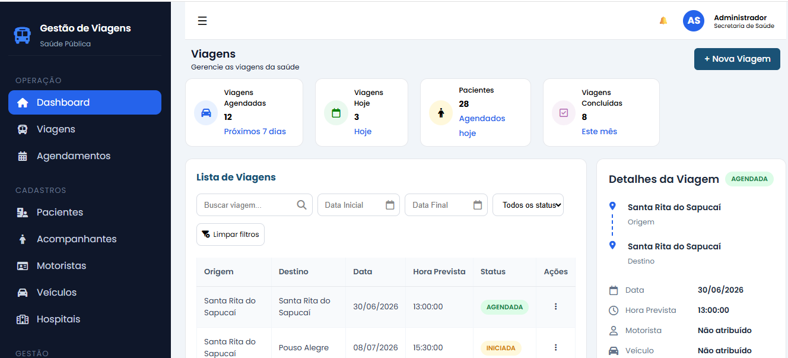
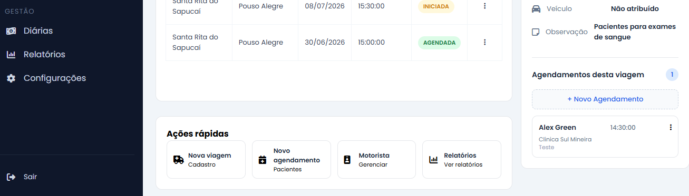
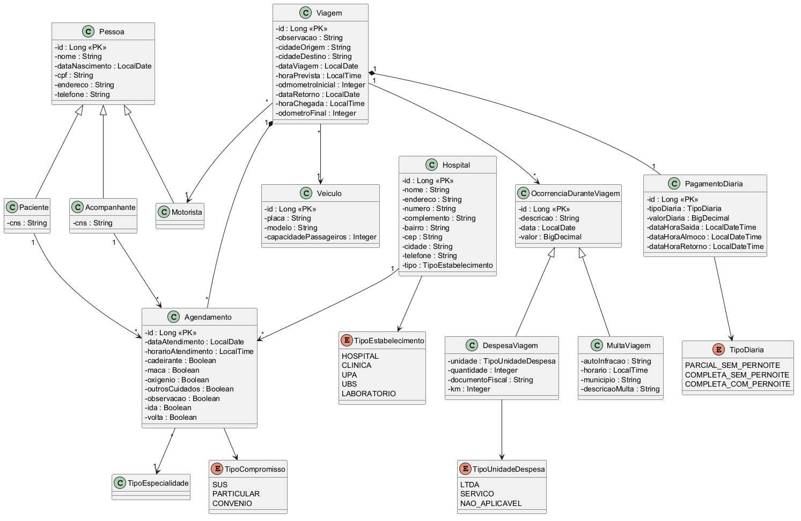

## Mapa de Viagem 


API REST desenvolvida com Java e Spring Boot para gerenciamento do transporte de pacientes da rede pública de saúde, , integrada a um frontend desenvolvido em HTML, CSS e JavaScript.
A aplicação permite controlar viagens, pacientes, acompanhantes, motoristas, veículos e agendamentos, aplicando regras de negócio que garantem a consistência das operações durante todo o ciclo da viagem.

## Dashboard

### Visão Geral


### Painel de Detalhes e Ações Rápidas


## Funcionalidades

- Cadastro de viagens
- Cadastro de pacientes
- Cadastro de acompanhantes
- Cadastro de motoristas
- Cadastro de veículos
- Cadastro de hospitais
- Cadastro de agendamentos
- Controle de ocorrências durante a viagem
- Fechamento de viagens com validações de negócio 

## Tecnologias

- Java
- Spring Boot
- Spring Data JPA / Hibernate
- H2 Database
- JavaScript
- Git / GitHub
- Maven
- Postman
- HTML
- Javascript
- CSS

## Arquitetura

O projeto segue arquitetura em camadas:

- Controller
- Service
- Repository
- DTO
- Entity

O frontend em JavaScript consome a API REST por meio de requisições HTTP.

##  Estrutura do Projeto
- src/main → backend (API REST)
- src/frontend → interface web consumindo a API

## Modelo de Domínio




##  Como executar o projeto

### Backend

```bash
git clone https://github.com/fabirvale/mapa-viagem.git
cd mapa-viagem
./mvnw spring-boot:run
```

A API será iniciada em:

```
http://localhost:8080
```

### Frontend

Abra o arquivo `src/frontend/index.html` utilizando uma extensão como Live Server do VS Code.

## 🗄 Banco de Dados
O projeto utiliza H2 (banco em memória) para facilitar execução e testes.
A estrutura é compatível com MySQL, podendo ser adaptada para uso em ambiente real.

##  Exemplos de endpoints
- GET    /viagens
- POST   /viagens
- PUT    /viagens/{id}
- DELETE /viagens/{id}

- GET    /pacientes
- GET    /motoristas
- GET    /veiculos
- GET    /agendamentos

## Status do Projeto
Em evolução, com melhorias contínuas e implementação de novas funcionalidades.

## Destaques técnicos
- API REST com Spring Boot
- Arquitetura em camadas (Controller, Service, Repository)
- Uso de DTOs
- Integração frontend + backend com JavaScript
- Regras de negócio na camada de serviço
