## CTV001 - Cadastrar viagem válida

**Resultado:** ✅ Aprovado

### Evidência

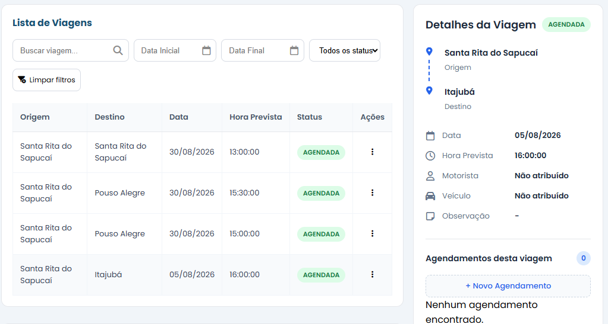

---

## CTV002 - Cadastrar viagem sem motorista

**Resultado:** ✅ Aprovado

### Evidência

Utilizada a mesma evidência do CTV001.

---

## CTV003 - Cadastrar viagem sem veículo

**Resultado:** ✅ Aprovado

### Evidência

Utilizada a mesma evidência do CTV001.

## CTV004 - Cadastrar viagem duplicada

**Resultado:** ✅ Aprovado

### Evidência

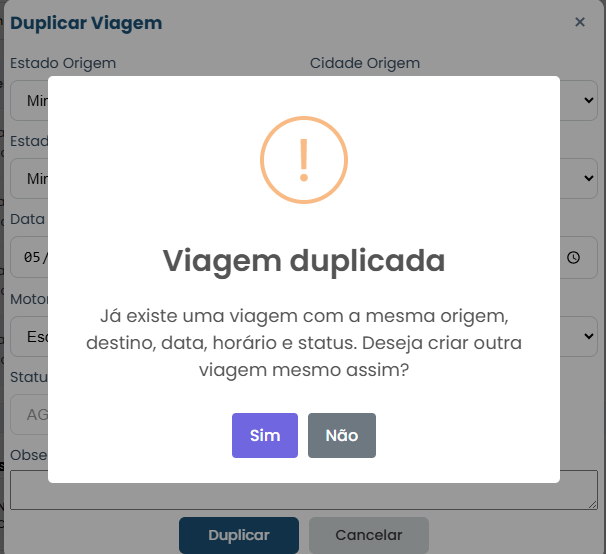

## CTV005 - Confirmar cadastro de viagem duplicada

**Objetivo**

Verificar se o sistema permite cadastrar uma viagem duplicada após a confirmação do usuário.

**Pré-condições**

- Executar o cenário **CTV004**.
- A mensagem de confirmação de duplicidade deverá estar sendo exibida.

**Passos**

1. Na mensagem de confirmação, clicar em **Sim**.

**Resultado esperado**

- O sistema deverá cadastrar uma nova viagem.
- A viagem original deverá permanecer inalterada.
- A nova viagem deverá ser exibida na listagem juntamente com a viagem original.

---

**Resultado:** ✅ Aprovado

### Evidência

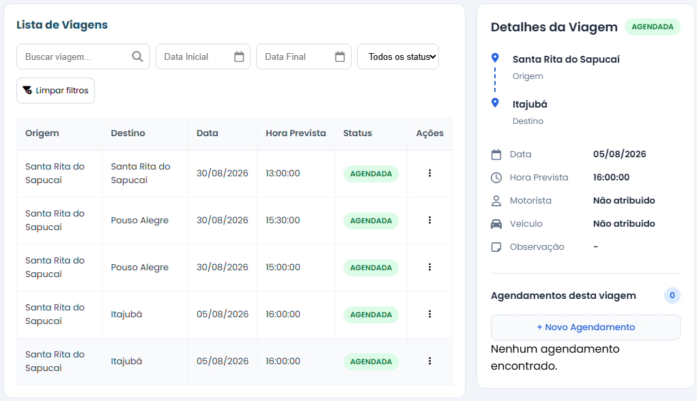

## CTV006 - Editar viagem válida

**Objetivo**

Verificar se uma viagem AGENDADA pode ser editada.

**Pré-condições**

Existir uma viagem AGENDADA.

**Passos**

1.  Selecionar a viagem.
2.  Clicar em Editar.
3.  Alterar um ou mais campos permitidos.
4.  Salvar.

**Resultado esperado**

A viagem deverá ser atualizada com sucesso.

**Resultado:** ✅ Aprovado

### Evidência

Os campos motorista e veículo foram alterados.

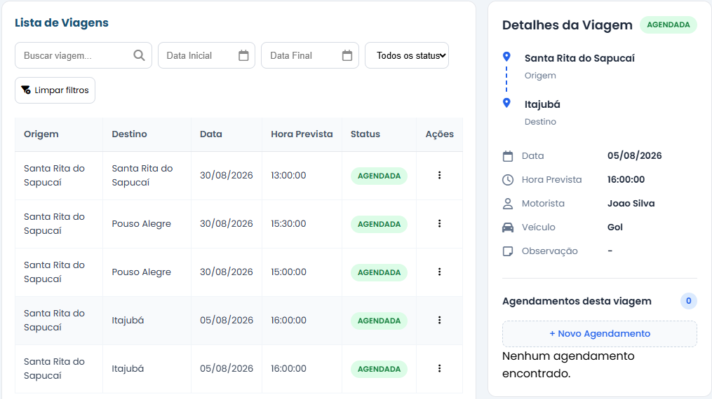

### CTV007 -- Editar viagem EM_ANDAMENTO

**Objetivo**

Verificar que viagens em andamento não podem ser editadas.

**Pré-condições**

Existir uma viagem EM_ANDAMENTO.

**Passos**

1.  Selecionar a viagem.
2.  Tentar editar.

**Resultado esperado**

O sistema deverá impedir a edição.

**Resultado:** ✅ Aprovado

### Evidência

### CTV008 -- Editar viagem FINALIZADA

**Objetivo**

Verificar que viagens finalizadas não podem ser editadas.

**Pré-condições**

Existir uma viagem FINALIZADA.

**Passos**

1.  Selecionar a viagem.
2.  Tentar editar.

**Resultado esperado**

O sistema deverá impedir a edição.

**Resultado:** não foi validado (em implementação)

### Evidência

### CTV009 -- Alterar data sem agendamentos

**Objetivo**

Verificar a alteração da data quando não existem agendamentos.

**Pré-condições**

Viagem sem agendamentos vinculados.

**Passos**

1.  Editar a viagem.
2.  Alterar a data.
3.  Salvar.

**Resultado esperado**

A data deverá ser alterada.

**Resultado:** ✅ Aprovado

### Evidência

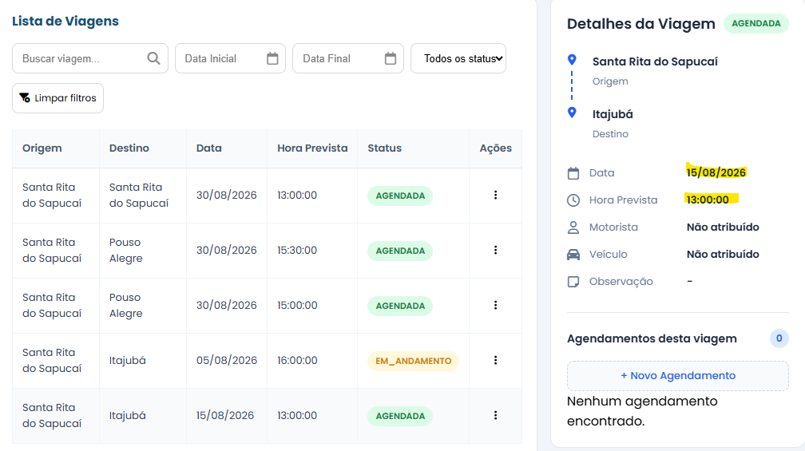

### CTV010 -- Alterar data com agendamentos

**Objetivo**

Verificar o comportamento da alteração da data de uma viagem futura com agendamentos vinculados.

**Pré-condições**

Viagem com agendamentos vinculados.Existir uma viagem com status AGENDADA e data futura.
Existir pelo menos um agendamento vinculado à viagem.
A data do agendamento ser igual à data atual da viagem.

**Passos**

1. Editar a viagem.
2. Alterar a data da viagem para uma nova data futura.
3. Salvar a alteração.
4. Na mensagem de confirmação, selecionar Sim, autorizando a alteração da data dos agendamentos.

**Resultado esperado**

Alterar a data da viagem para a nova data.
Alterar a data dos agendamentos vinculados para a mesma nova data.
Manter os agendamentos vinculados à viagem.
Informar que a alteração foi realizada com sucesso.

**Resultado:** ✅ Aprovado

### Evidência

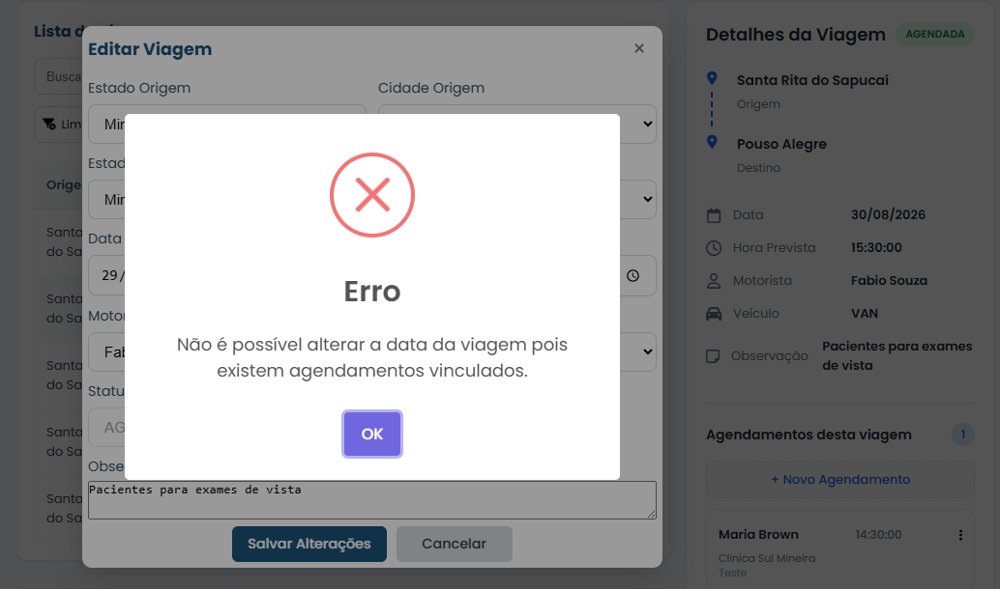

##CTV011 — Recusar alteração da data dos agendamentos

**Objetivo**

Verificar o comportamento quando o usuário não autoriza a alteração dos agendamentos vinculados.

**Pré-condições**

Existir uma viagem com status AGENDADA e data futura.
Existir pelo menos um agendamento vinculado à viagem.

**Passos**

1. Editar a viagem.
2. Alterar a data da viagem para uma nova data futura.
3. Salvar a alteração.
4. Na mensagem de confirmação, selecionar Não.

**Resultado:** ✅ Aprovado

### Evidência

## CTV012 - Remover motorista ou veículo de viagem agendada

**Objetivo**

Verificar se o usuário consegue remover o motorista ou veículo de uma viagem com status **AGENDADA**.

**Pré-condições**

- Existir uma viagem com status **AGENDADA**.
- A viagem possuir motorista e veículo vinculados.

**Passos**

1. Selecionar a viagem.
2. Clicar em **Editar**.
3. Selecionar a opção **Escolher motorista**.
4. Selecionar a opção **Escolher veículo**, se necessário.
5. Clicar em **Salvar**.

**Resultado esperado**

- A viagem deverá ser atualizada com sucesso.
- O motorista e/ou veículo removido deverá deixar de estar vinculado à viagem.
- A viagem deverá permanecer com status **AGENDADA**.
- A viagem poderá permanecer sem motorista ou veículo enquanto estiver agendada.

**Resultado:** ✅ Aprovado

### Evidência

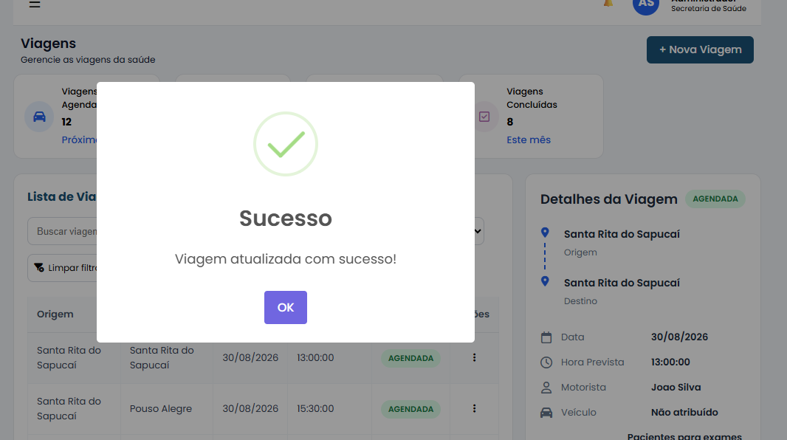

# Funcionalidade: Duplicar Viagem

## Regras de Negócio

### RNV013

A funcionalidade de duplicação deverá obedecer às mesmas regras de cadastro da viagem.

### RNV014

Ao selecionar **Duplicar**, o sistema deverá abrir um novo formulário preenchido com os dados da viagem selecionada, permitindo alterações antes da confirmação.

## Cenários de Teste

### CTV013 - Abrir formulário de duplicação

**Objetivo**

Verificar se o sistema abre um novo formulário preenchido com os dados da viagem selecionada.

**Resultado esperado**

- O formulário deverá ser aberto preenchido.
- O usuário poderá alterar os dados antes da confirmação.

> A validação das regras de duplicidade e confirmação é realizada pelos cenários **CTV004** e **CTV005** do módulo de Cadastro de Viagem.

# Funcionalidade: Iniciar Viagem

## Regras de Negócio

### RNV017

É permitido iniciar somente viagens com status **AGENDADA**.

---

### RNV018

Não é permitido iniciar uma viagem que não possua agendamentos vinculados.

---

### RNV019

Não é permitido iniciar uma viagem sem motorista vinculado.

---

### RNV020

Não é permitido iniciar uma viagem sem veículo vinculado.

---

### RNV021

Ao iniciar uma viagem, o sistema deverá alterar seu status para **EM_ANDAMENTO**.

### RNV022

Não é permitido iniciar uma viagem cuja data seja posterior à data atual.

# Cenários de Teste

## CTV018 - Iniciar viagem válida

### Objetivo

Verificar se o sistema permite iniciar uma viagem com status **AGENDADA**.

### Pré-condições

- Aplicação em execução.
- Existir uma viagem com status **AGENDADA**.
- A viagem possuir pelo menos um agendamento vinculado.
- A viagem possuir motorista vinculado.
- A viagem possuir veículo vinculado.

### Passos

1. Selecionar uma viagem com status **AGENDADA**.
2. Clicar em **Iniciar Viagem**.

**Resultado:** ✅ Aprovado

### Evidência

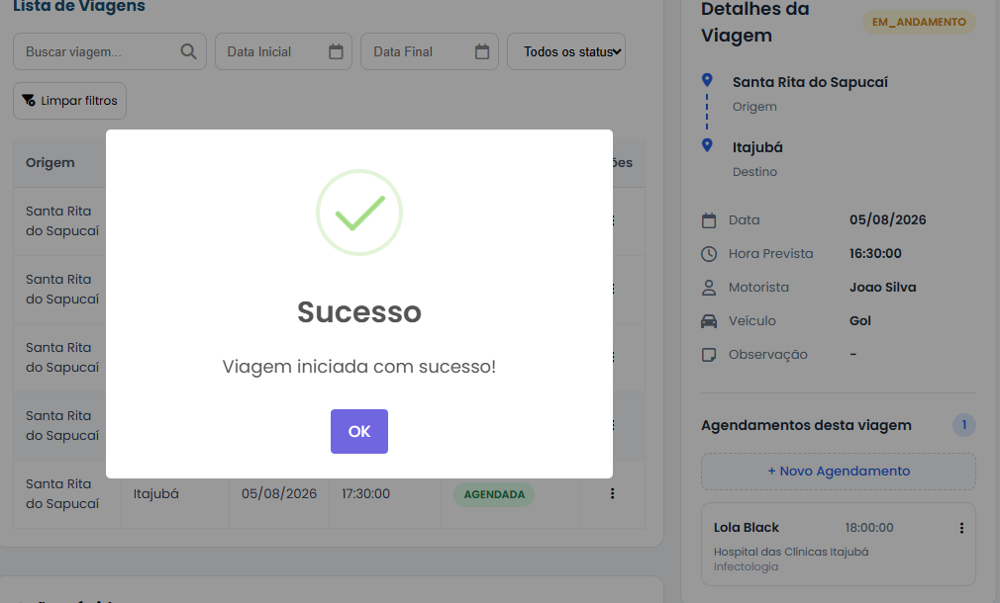

## CTV019 - Iniciar viagem sem agendamento

### Objetivo

Verificar se o sistema impede iniciar uma viagem sem agendamentos vinculados.

### Pré-condições

- Existir uma viagem com status **AGENDADA**.
- A viagem não possuir agendamentos vinculados.

### Passos

1. Selecionar a viagem.
2. Clicar em **Iniciar Viagem**.

**Resultado:** ✅ Aprovado

### Evidência

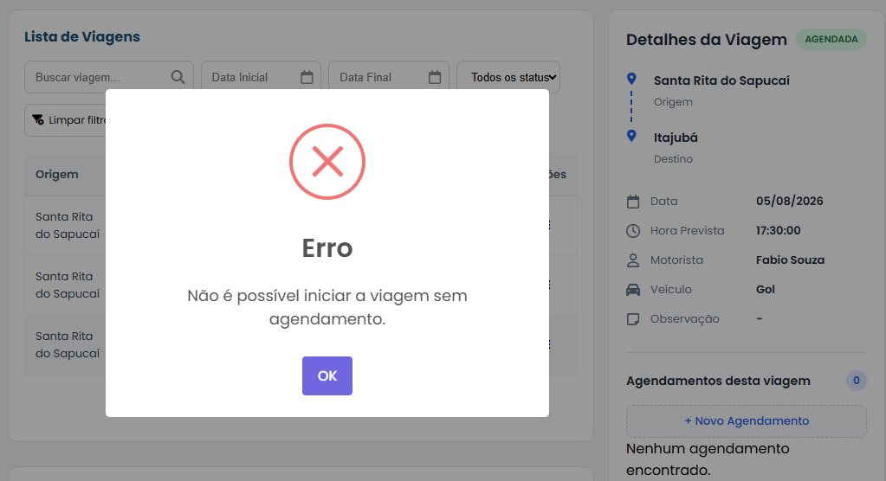

## CTV020 - Iniciar viagem sem motorista

### Objetivo

Verificar se o sistema impede iniciar uma viagem sem motorista vinculado.

### Pré-condições

- Existir uma viagem com status **AGENDADA**.
- A viagem possuir agendamento.
- A viagem não possuir motorista.

### Passos

1. Selecionar a viagem.
2. Clicar em **Iniciar Viagem**.

**Resultado:** ✅ Aprovado

### Evidência

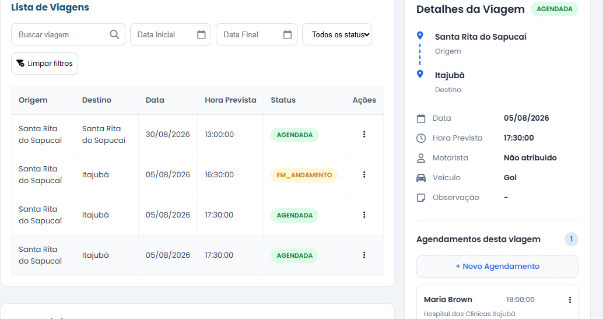

## CTV021 - Iniciar viagem sem veículo

### Objetivo

Verificar se o sistema impede iniciar uma viagem sem veículo vinculado.

### Pré-condições

- Existir uma viagem com status **AGENDADA**.
- A viagem possuir agendamento.
- A viagem possuir motorista.
- A viagem não possuir veículo.

### Passos

1. Selecionar a viagem.
2. Clicar em **Iniciar Viagem**.

**Resultado:** ✅ Aprovado

### Evidência

## CTV022 - Iniciar viagem com status diferente de AGENDADA

### Objetivo

Verificar se o sistema impede iniciar viagens com status diferente de **AGENDADA**.

### Pré-condições

Existir uma viagem com status:

- EM_ANDAMENTO; ou
- CANCELADA; ou
- FINALIZADA (quando implementada).

### Passos

1. Selecionar a viagem.
2. Clicar em **Iniciar Viagem**.

**Resultado:** ✅ Aprovado

### Evidência

### CTV023 - Tentar iniciar viagem com data futura

**Objetivo**

Verificar se o sistema impede o início de uma viagem com data futura.

**Pré-condições**

- Existir uma viagem com status **AGENDADA**.
- A data da viagem ser posterior à data atual.
- A viagem possuir agendamento, motorista e veículo.

**Passos**

1. Selecionar uma viagem com data futura.
2. Clicar em **Iniciar Viagem**.
3. Confirmar a operação.

**Resultado esperado**

O sistema deverá impedir o início da viagem e informar que não é possível iniciar uma viagem com data futura.

### Passos

1. Selecionar a viagem.
2. Clicar em **Iniciar Viagem**.

**Resultado:** ✅ Aprovado

### Evidência

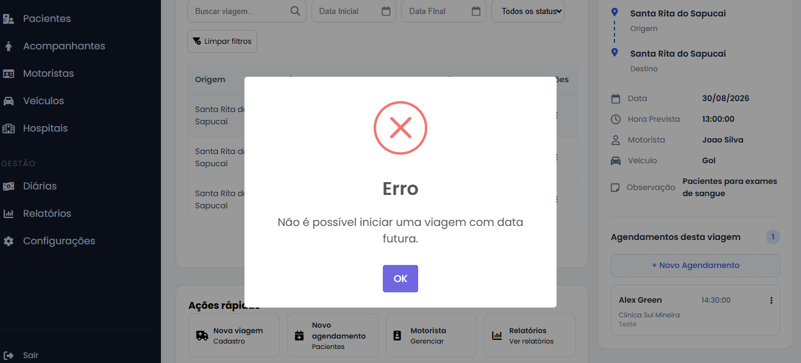

# Funcionalidade: Cancelar Viagem

## Regras de Negócio

### RNV022

É permitido cancelar somente viagens com status **AGENDADA**.

---

### RNV023

Ao cancelar uma viagem, o sistema deverá alterar seu status para **CANCELADA**.

---

### RNV024

É permitido registrar uma observação referente ao motivo do cancelamento da viagem.

# Cenários de Teste

## CTV023 - Cancelar viagem válida

### Objetivo

Verificar se o sistema permite cancelar uma viagem com status **AGENDADA**.

### Pré-condições

- Aplicação em execução.
- Existir uma viagem com status **AGENDADA**.

### Passos

1. Selecionar uma viagem com status **AGENDADA**.
2. Clicar em **Cancelar Viagem**.
3. Informar uma observação (opcional).
4. Confirmar o cancelamento.

### Resultado esperado

- O sistema deverá alterar o status da viagem para **CANCELADA**.
- A observação informada deverá ser gravada na viagem.
- A viagem deverá permanecer na listagem com o novo status.

---**Resultado:** ✅ Aprovado

### Evidência

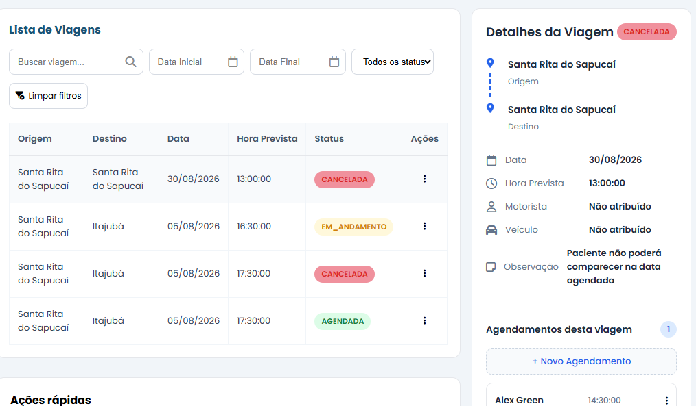

## CTV024 - Cancelar viagem EM_ANDAMENTO

### Objetivo

Verificar se o sistema impede o cancelamento de uma viagem com status **EM_ANDAMENTO**.

### Pré-condições

Existir uma viagem com status **EM_ANDAMENTO**.

### Passos

1. Selecionar a viagem.
2. Clicar em **Cancelar Viagem**.

---**Resultado:** ✅ Aprovado

### Evidência

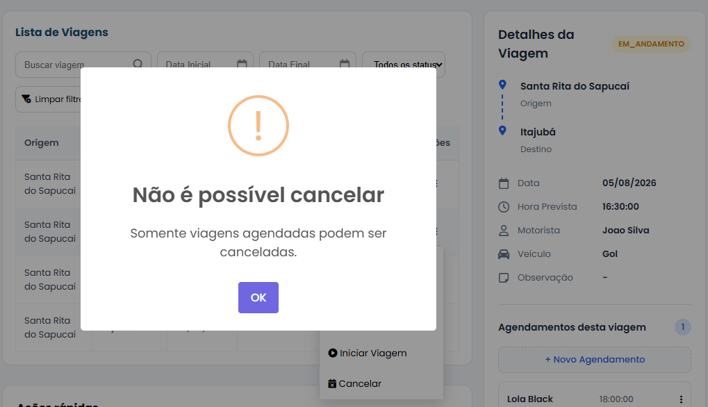

---

## CTV025 - Cancelar viagem CANCELADA

### Objetivo

Verificar se o sistema impede o cancelamento de uma viagem já cancelada.

### Pré-condições

Existir uma viagem com status **CANCELADA**.

### Passos

1. Selecionar a viagem.
2. Clicar em **Cancelar Viagem**.

---**Resultado:** ✅ Aprovado

### Evidência

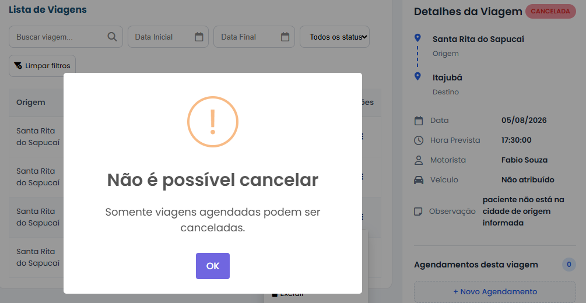

---

## CTV026 - Cancelar viagem FINALIZADA

### Objetivo

Verificar se o sistema impede o cancelamento de uma viagem com status **FINALIZADA**.

### Pré-condições

Existir uma viagem com status **FINALIZADA** (quando esta funcionalidade estiver implementada).

### Passos

1. Selecionar a viagem.
2. Clicar em **Cancelar Viagem**.

---**Resultado:** ✅ Aprovado - necessário implementar o metodo finalizar

### Evidência

# Funcionalidade: Excluir Viagem

## Regras de Negócio

### RNV025

É permitido excluir somente viagens com status **AGENDADA**.

---

### RNV026

Não é permitido excluir viagens que possuam agendamentos vinculados.

---

### RNV027

Após a exclusão, a viagem deverá ser removida definitivamente do sistema.

# Cenários de Teste

## CTV027 - Excluir viagem válida

### Objetivo

Verificar se o sistema permite excluir uma viagem com status **AGENDADA**.

### Pré-condições

- Aplicação em execução.
- Existir uma viagem com status **AGENDADA**.
- A viagem não possuir agendamentos vinculados.

### Passos

1. Selecionar uma viagem com status **AGENDADA**.
2. Clicar em **Excluir**.
3. Confirmar a exclusão.

---**Resultado:** ✅ Aprovado 

### Evidência

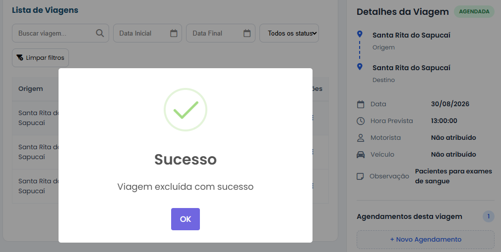

## CTV028 - Excluir viagem com agendamentos vinculados

### Objetivo

Verificar se o sistema impede a exclusão de uma viagem que possua agendamentos vinculados.

### Pré-condições

- Existir uma viagem com status **AGENDADA**.
- A viagem possuir pelo menos um agendamento vinculado.

### Passos

1. Selecionar a viagem.
2. Clicar em **Excluir**.
3. Confirmar a exclusão.

---**Resultado:** ✅ Aprovado 

### Evidência

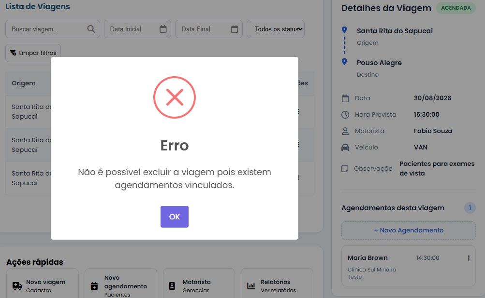

## CTV029 - Excluir viagem EM_ANDAMENTO

### Objetivo

Verificar se o sistema impede a exclusão de uma viagem com status **EM_ANDAMENTO**.

### Pré-condições

Existir uma viagem com status **EM_ANDAMENTO**.

### Passos

1. Selecionar a viagem.
2. Clicar em **Excluir**.

---**Resultado:** ✅ Aprovado 

### Evidência

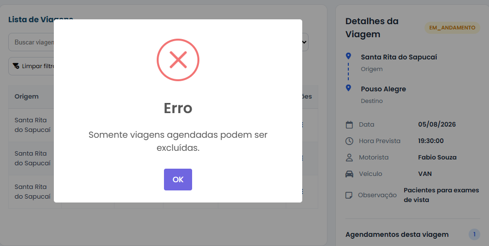

## CTV030 - Excluir viagem CANCELADA

### Objetivo

Verificar se o sistema impede a exclusão de uma viagem com status **CANCELADA**.

### Pré-condições

Existir uma viagem com status **CANCELADA**.

### Passos

1. Selecionar a viagem.
2. Clicar em **Excluir**.

---**Resultado:** ✅ Aprovado 

### Evidência

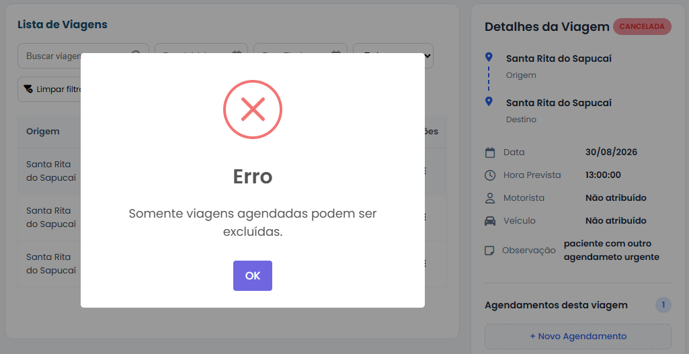

## CTV031 - Excluir viagem FINALIZADA

### Objetivo

Verificar se o sistema impede a exclusão de uma viagem com status **FINALIZADA**.

### Pré-condições

Existir uma viagem com status **FINALIZADA** (quando esta funcionalidade estiver implementada).

### Passos

1. Selecionar a viagem.
2. Clicar em **Excluir**.

---**Resultado:** ✅ Aprovado - metodo finalizar precisa ser implementado

### Evidência

